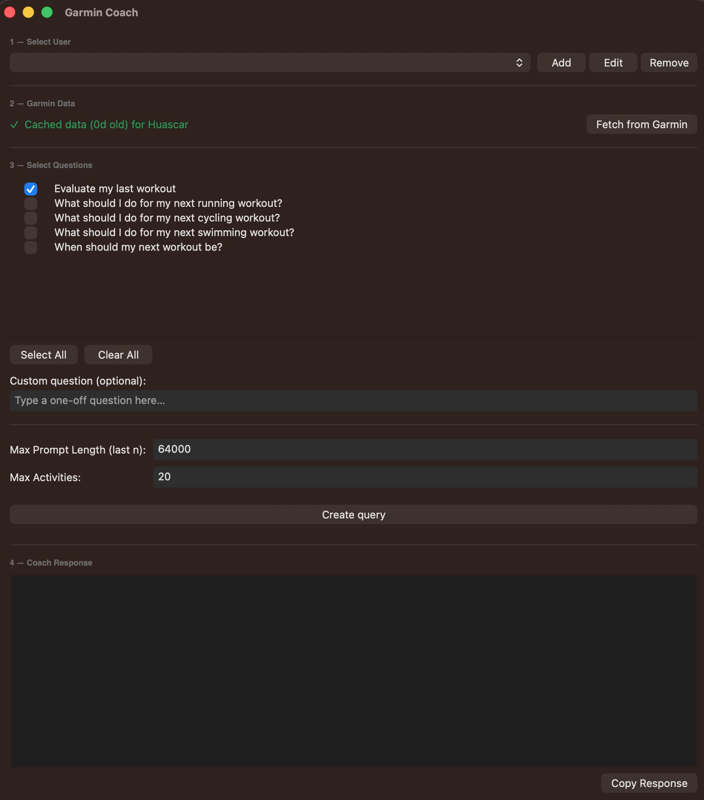

# Garmin Coach

A desktop app (wxPython) that pulls your Garmin Connect activity data and builds a structured prompt you can send to an LLM "coach" for training advice — evaluating past workouts, planning the next one, or answering custom questions.



## Features

- **Multi-user support** — add, edit, and remove users, each with their own Garmin email and cached data.
- **Garmin data fetch** — pulls activity data via `GarminManager`, with local caching (data is considered stale after 1 day and auto-refetches).
- **Question builder** — pick from a preset list of coaching questions, or type a custom one-off question.
- **Prompt generation** — serializes your Garmin data (trimmed to a max number of recent activities and a max character length) alongside your selected questions into a single prompt.
- **Copy to clipboard** — copy the generated prompt/response for pasting into your LLM of choice.

## Usage

1. **Select User** — choose an existing user from the dropdown, or use **Add**, **Edit**, **Remove** to manage users.
2. **Garmin Data** — fetches fresh data from Garmin (prompts for password on first use per user; cached afterward).
3. **Select Questions** — check the preset questions you want answered, and/or add a custom question.
4. **Create query** — set max prompt length / max activities, then generate the combined data + questions prompt.
5. **Coach Response** — view and copy the generated prompt (or, once wired to an LLM connector, the coach's response).


## Requirements

- Python 3.x
- [wxPython](https://wxpython.org/)
- A `garmin_manager.py` module providing a `GarminManager` class with (at minimum):
  - `get_cached_data(email)`
  - `fetch_user_data(email, password)`
  - `get_password(email)` / `save_password(email, password)`
  - Optional, used by user management: `delete_user_data(email)` or `delete_password(email)`, and `rename_user(old_email, new_email)`

Install dependencies:

```bash
pip install wxPython
```

## Running

```bash
python main.py
```

On first run (or if no users exist), you'll be prompted to create a user by entering a name and Garmin email.

## Config & data storage

App data is stored per-OS in a dedicated folder:

| OS      | Location                                      |
|---------|------------------------------------------------|
| macOS   | `~/Library/Application Support/GarminCoach`     |
| Windows | `%APPDATA%\GarminCoach`                         |
| Linux   | `~/.garmin_coach`                               |

Inside that folder:

- `config.json` — users, preset questions, and custom questions
- `query.txt` — last generated query (if used)
- `.cache/` — cached Garmin activity data per user

## Notes

- The LLM connector (`llm_connectors.OllamaConnector`) and the "Ask Coach" button are currently commented out in `main.py`; only prompt generation ("Create query") is active.
- Removing a user also attempts to delete their cached data and saved Garmin password, if `GarminManager` supports it.
